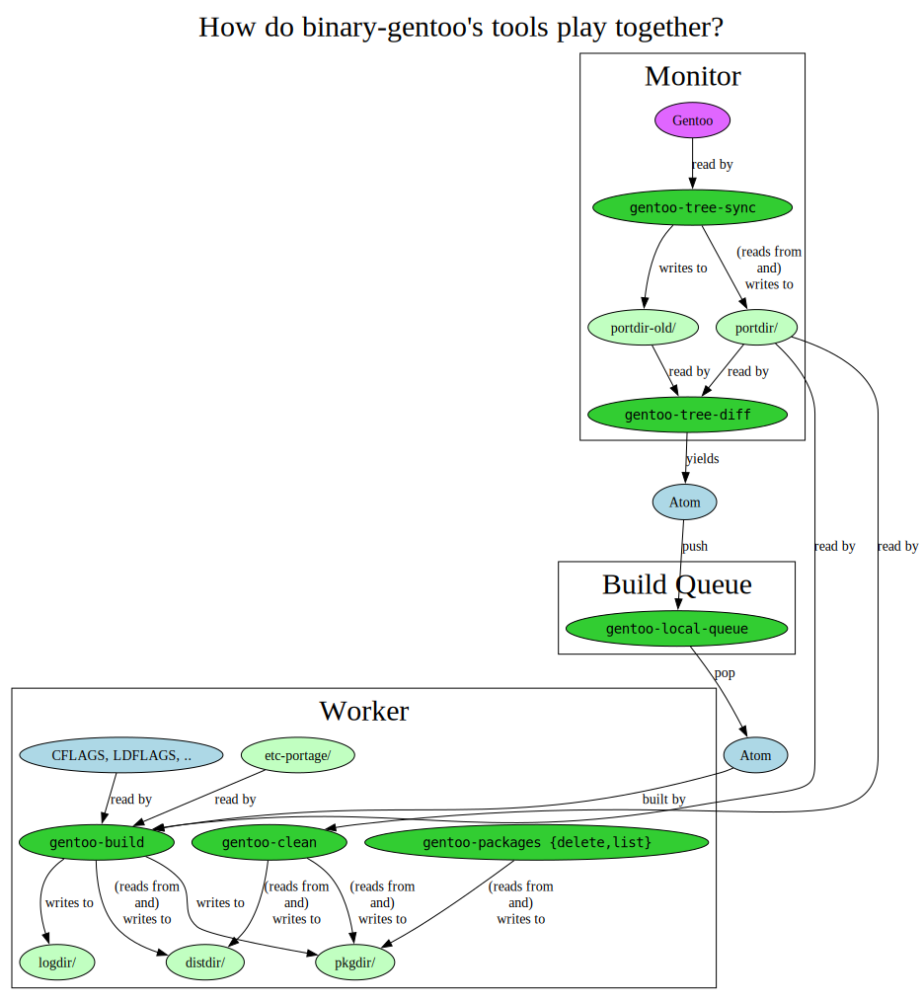

[](https://github.com/pre-commit/pre-commit)
[](https://github.com/hartwork/binary-gentoo/actions/workflows/smoke_test.yml)

# binary-gentoo

## About

**binary-gentoo**
is a collection of
simple
CLI tools
to help **build Gentoo packages on a non-Gentoo Linux host**, primarily.
A typical scenario is operation of an
**_active_ [Gentoo binary package host](https://wiki.gentoo.org/wiki/Binary_package_guide#Setting_up_a_binary_package_host)**
 — an active "binhost".

*Secondarily*, **binary-gentoo** can also build Gentoo packages on a Gentoo host
with Docker isolation and a full `emerge` perspective
(while not affecting your host system).

There currently four CLI tools
that follow the [Unix philosophy](https://en.wikipedia.org/wiki/Unix_philosophy)
and are meant to be combined using a glue language like Bash:

- `gentoo-build` – Builds a Gentoo package with Docker isolation
- `gentoo-clean` — Clean Gentoo pkgdir/distdir files using `eclean` of `app-portage/gentoolkit` with Docker isolation
- `gentoo-local-queue` – Manages simple file-based push/pop build task queues
- `gentoo-packages` — Do operations on pkgdir (other than `emaint --fix binhost`)
- `gentoo-tree-diff` – Lists packages/versions/revisions that one portdir has over another
- `gentoo-tree-sync` – Brings a given portdir directory (and its backup) up to date

**binary-gentoo**
is software libre licensed under the `GNU Affero GPL version 3 or later` license.


## Installation

Install Docker, Python >=3.9, pip and rsync and then:

```console
# pip install binary-gentoo
```


## Active Binhost Operation

Let's start with a picture:

[](binary-gentoo.svg)
(Graphviz source: [`binary-gentoo.dot`](binary-gentoo.dot))

To set-up an active binhost using **binary-gentoo** you will likely need
a virtual machine with…

- Enough resources, i.e. probably
  - []()>=2 virtual cores
  - []()>=8 GB RAM
  - []()>=100 GB disk space
- Some distribution of Linux
- Auto-updates enabled to stay reasonably secure over time
- Runtime dependencies installed:
  - Docker
  - Python >=3.9
  - rsync
- An SSH or an HTTP daemon
  (to serve the produced binaries to your consuming Gentoo boxes,
  unless that is done from another machine)
- An up-to-date copy of the `/etc/portage` folder to use
- An up-to-date text file with the names of all packages to build,
  e.g. generated by `EIX_LIMIT=0 eix -I --only-names`
- A set of compile flags (`CFLAGS`, `CXXFLAGS`, `LDFLAGS`, `CPU_FLAGS_X86`)
  that works for *both* the producing machine and the consuming machine(s)
  and ideally [resolve-march-native](https://github.com/hartwork/resolve-march-native)
  installed — more on finding the ideal flags below
- Two portdir copies — one synced with `gentoo-tree-sync` (or some form of `git pull`),
  the other brought back in sync using `rsync` after a call to `gentoo-tree-diff`
- A glue script that…
  - respects your inclusion list
    (e.g. `grep -q -f installed.txt -F <<<"${atom}" || continue`
    if a few false positives are okay)
  - respects your exclusion list
    (e.g. something like `*sys-kernel/*|*-bin-*|*-9999*|*acct-*/*`)
  - pushes `gentoo-tree-diff` news onto the queue
  - pops off the queue,
    extracts the atom using e.g. `jq -r .atom`,
    and then let's `gentoo-build` do a build
  - loops forever
  - sleeps every now and then
  - runs `gentoo-clean` every now and then


## Determining Ideal Build Flags

Let me give a concrete example.


### Consumer Machine

On the consumer machine, we have this hardware situation:

```console
# lscpu | fgrep 'Model name' | sed 's,^.\{33\},,'
Intel(R) Core(TM) i5-2520M CPU @ 2.50GHz

# resolve-march-native
-march=sandybridge -maes --param l1-cache-line-size=64 --param l1-cache-size=32 --param l2-cache-size=3072 -O2 -pipe

# cpuid2cpuflags
CPU_FLAGS_X86: aes avx mmx mmxext pclmul popcnt sse sse2 sse3 sse4_1 sse4_2 ssse3
```


### Producer Machine

On the [producer machine](https://www.netcup.de/bestellen/produkt.php?produkt=2554),
we have this hardware situation:

```console
# lscpu | fgrep 'Model name' | sed 's,^.\{33\},,'
QEMU Virtual CPU version 2.5+

# resolve-march-native
-march=k8-sse3 -maes -mcx16 -mno-3dnow -mno-3dnowa -mpclmul -mpopcnt -mrdrnd -msahf -msse4 -msse4.1 -msse4.2 -mssse3 -mtune=k8 --param=l1-cache-line-size=64 --param=l1-cache-size=64 --param=l2-cache-size=512 -O2 -pipe

# cpuid2cpuflags
CPU_FLAGS_X86: aes mmx mmxext pclmul popcnt rdrand sse sse2 sse3 sse4_1 sse4_2 ssse3
```


### Resulting Producer Build Flags


Simplified, we are looking for flags
that are **as close to the consumer machines as possible**
while still resulting in binaries,
that **both the consumer machines and the producer machine can execute**
(so that the producer machine is be able to install and run the binaries of *dependencies* of the package of interest).

For the example above, I ended up with these values for the producer machine:

- `CFLAGS`: `-march=x86-64 -mtune=sandybridge -maes --param l1-cache-line-size=64 --param l1-cache-size=32 --param l2-cache-size=3072 -mpclmul -mpopcnt -msse4.1 -msse4.2 -mssse3  -O2 -pipe` (note `-march` and `-mtune` in particular)
- `CXXFLAGS`: same as `CFLAGS`
- `LDFLAGS`: whatever `portageq envvar LDFLAGS` on the consumer machine returns
- `CPU_FLAGS_X86`: `aes mmx mmxext pclmul popcnt sse sse2 sse3 sse4_1 sse4_2 ssse3` (i.e. without `avx` and without `rdrand`)


## Design Decisions

- All code in **binary-gentoo** must work on a non-Gentoo Linux machine,
  provided that it has Docker installed and working internet access.

- Big packages like Chromium need a pile of RAM and CPU time.
  Therefore, the build defaults to `MAKETOPTS=-j1`
  the package of interest is emerged separate from it dependencies.
  That allows to build e.g. a package of Chromium in a VM with only 8 GB of RAM.

- With regard to dependency constraints,
  some packages can be *built* without conflicts but not be *installed* without conflicts.
  Hence the default is to only install dependencies, but not the package of interest.
